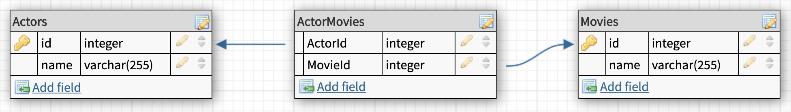

# FLASH lecture - Sequelize

How to use Sequelize as an ORM and as a DB migration tool

## Table of Contents

- [Install and start](#install-and-start)
- [Installing Sequelize in your project](#installing-sequelize-in-your-project)
- [DB Migrations](#db-migrations)
  - [Create models and migrations](#create-models-and-migrations)
  - [Run migrations](#run-migrations)
  - [Create seeds](#create-seeds)
  - [Run seeds](#run-seeds)
  - [Migration skeleton](#migration-skeleton)
    - [Add column for Artists-Albums relationship](#add-column-for-artists-albums-relationship)
    - [Add table for Actors-Movies relationship](#add-table-for-actors-movies-relationship)
- [ORM](#orm)
  - [Add associations](#add-associations)
  - [Query data](#query-data)
    - [Select all](#select-all)
    - [Select one](#select-one)
    - [Create](#create)
    - [Select resource with associated data using `include`](#select-resource-with-associated-data-using--include-)
    - [Select association with `get[Resource]`](#select-association-with--get-resource--)
    - [Create with association with `create[Resource]`](#create-with-association-with--create-resource--)
  - [Many-to-Many associations](#many-to-many-associations)
    - [Select resource with list of resources association](#select-resource-with-list-of-resources-association)
    - [Create with association with `create[Resource]`](#create-with-association-with--create-resource---1)
    - [Add resources with `add[Resource]` or set with `set[Resource]`](#add-resources-with--add-resource---or-set-with--set-resource--)
  - [Raw queries](#raw-queries)
- [Nested relationships](#nested-relationships)
  - [Get nested relationships](#get-nested-relationships)
  - [Count nested relationships](#count-nested-relationships)
- [Same-model relationships](#same-model-relationships)
  - [One-To-Many](#one-to-many)
  - [Many-To-Many](#many-to-many)
- [Dynamic configuration](#dynamic-configuration)

## Install and start

- Jump to `start` branch if you want to follow along from the start:

```bash
git checkout start
```

- Install dependencies

```bash
npm install
```

- Start the development server on port 4000

```bash
npm start
```

## Installing Sequelize in your project

If you want to install Sequelize in your project, you need to install two dependencies.

You don't need to do this for this repository as they are already included in the `package.json` file.

```bash
npm install sequelize mysql2
```

## DB Migrations

Present the session to students: the **WHY** (the problem we're tring to solve), the **WHAT** (the tool that will help us solve this problem), and the **HOW**, how the tool works to allow us to solve the problem.

**WHY**: Explain to students the issue with when updating schema and having to inform other developers what to modify in their own schema to have the same version synced (in other words, git allows us to share code, but we don't share the DB)

**WHAT**: Migration libraries/frameworks allows us to keep changes on the DB schema in a sequential way. Most ORMs libraries include their own migration tools - we will be using Sequelize's

**HOW**: For every schema in the database that we need to do, we will create a new migration entry point. A new file will be automatically created, in which we will include all the instructions for setting the migration up and down (applying it or unapplying it). These files are shared with git, this way other devs can automatically upgrade their DBs just by running the migration (ie executing the migration files on their computers).

https://sequelize.org/

- `npm install --save-dev sequelize-cli`. Explain what a CLI is: just a tool that will help us scaffold new files very quickly!

- Init the folder structure with `npx sequelize-cli init`

This will create the following folders

-`config`, contains config file, which tells CLI how to connect with database

-`models`, contains all models for your project

-`migrations`, contains all migration files

-`seeders`, contains all seed files

- Make sure you create a database in MySQL that we will be using in this session.

- Add your DB access data in `/config/config.json`

### Create models and migrations

- Use the CLI to create your models and migrations. Show the new files in `models` and `migrations` to the students

Artists and Albums:

```bash
npx sequelize-cli model:generate --name Artist --attributes name:string
```

```bash
npx sequelize-cli model:generate --name Album --attributes name:string
```

Movies and Actors:

```bash
npx sequelize-cli model:generate --name Movie --attributes name:string
```

```bash
npx sequelize-cli model:generate --name Actor --attributes name:string
```

### Run migrations

1. `npx sequelize-cli db:migrate` will execute all pending migrations.

2. Show the database tables to the students. Particularly, show them the `SequelizeMeta` table and show them how the two migrations have been executed.

3. To roll back the previous migration,

```bash
npx sequelize-cli db:migrate:undo
```

### Create seeds

Suppose we want to insert some data into a few tables by default. Seeds are a way to populate demo data on your DB.

Follow the instructions on the getting started.

1. Create a new seed file:

```bash
npx sequelize-cli seed:generate --name demo-artist
```

### Run seeds

1. `npx sequelize-cli db:seed:all`

### Migration skeleton

What if we want to create other DB tables that don't have a specific model linked to them, for example a pivot table? Or what if we have to make a modification on a table that already exists? We can create generic migration files in which we will add the instructions we need.

#### Add column for Artists-Albums relationship

Let's create a new migration to add the **one-to-many** relationship between Artists and Albums (One artist has many albums, one album belongs to one artist)

1. `npx sequelize-cli migration:generate --name add-associations`

2. Define the new column `ArtistId` for the table `Albums` in the new migration file:

```javascript
module.exports = {
  up: (queryInterface, Sequelize) => {
    return queryInterface.addColumn(
      "Albums", // name of Source model
      "ArtistId", // name of the key we're adding
      {
        type: Sequelize.INTEGER,
        references: {
          model: "Artists", // name of Target model
          key: "id", // key in Target model that we're referencing
        },
        onUpdate: "CASCADE",
        onDelete: "SET NULL",
      }
    );
  },

  down: (queryInterface, Sequelize) => {
    return queryInterface.removeColumn(
      "Albums", // name of Source model
      "ArtistId" // key we want to remove
    );
  },
};
```

3. Run the migration and show the table to the students

#### Add table for Actors-Movies relationship

For the Movies and Actors **many-to-many** relationship, we create a new juntion table (or pivot table).

We'll create the pivot table using a migration skeleton

1. `npx sequelize-cli migration:generate --name create-actor-movies`

2. Define the new table `ActorMovies` in the new migration file:

```javascript
module.exports = {
  up: (queryInterface, Sequelize) => {
    return queryInterface.createTable("ActorMovies", {
      ActorId: {
        type: Sequelize.INTEGER,
        references: {
          model: "Actors",
          key: "id",
        },
        allowNull: false,
      },
      MovieId: {
        type: Sequelize.INTEGER,
        references: {
          model: "Movies",
          key: "id",
        },
        allowNull: false,
      },
      createdAt: {
        allowNull: false,
        type: Sequelize.DATE,
      },
      updatedAt: {
        allowNull: false,
        type: Sequelize.DATE,
      },
    });
  },

  down: (queryInterface, Sequelize) => {
    return queryInterface.dropTable("ActorMovies");
  },
};
```

3. Run the migration and show the table to the students

4. All the `QueryInterface` methods available are documented in https://sequelize.org/v5/class/lib/query-interface.js~QueryInterface.html

## ORM

WHY: not typing MySQL or other queries directly - we can make mistakes, forget to escape things, etc.

WHAT: another layer of abstraction between our code and the database. It's basically a wrapper, a utility to build DB queries. A middleman between express and the DB.

HOW: we define our models - we say which resources we have, that we store in tables, and we define how they are (the columnns, and the types)

- additionally we define relationships between them
- then we can query for data using this Model wrapper, like User.findAll() or User.create() -> very nice syntax.

- Getting started covers pretty much everything basic: https://sequelize.org/v5/manual/getting-started.html
- Just go over with it with students and go explaining every step

### Add associations

```javascript
// models/artist.js
static associate(models) {
  // define association here
  Artist.hasMany(models.Album);
}

// models/album.js
static associate(models) {
  // define association here
  Album.belongsTo(models.Artist);
}
```

### Query data

In a routes file, require the models:

```javascript
var models = require("../models");
```

In an endpoint, query data:

#### Select all

```javascript
try {
  const artists = await models.Artist.findAll();
  res.send(artists);
} catch (error) {
  res.status(500).send(error);
}
```

#### Select one

```javascript
models.Artist.findOne({
  where: {
    id,
  },
});
```

#### Create

We get the inserted element as the result :)

```javascript
try {
  const artist = await models.Artist.create({ name });
  res.send(artist);
} catch (error) {
  res.status(500).send(error);
}
```

#### Select resource with associated data using `include`

```javascript
models.Artist.findOne({
  where: {
    id,
  },
  include: models.Album,
});
```

#### Select association with `get[Resource]`

```javascript
const artist = await models.Artist.findOne({
  where: {
    id,
  },
});

const albums = await artist.getAlbums();

res.send(albums);
```

#### Create with association with `create[Resource]`

```javascript
const artist = await models.Artist.findOne({
  where: {
    id,
  },
});

const album = await artist.createAlbum({ name });

res.send(album);
```

### Many-to-Many associations



https://sequelize.org/master/manual/assocs.html#many-to-many-relationships

https://sequelize.org/master/manual/assocs.html#special-methods-mixins-added-to-instances

#### Select resource with list of resources association

Get a `Actor` with all its `Movies`

```javascript
models.Actor.findOne({
  where: {
    id,
  },
  include: models.Movie,
});
```

This creates the following raw query, and takes care of grouping the results for us:

```sql
SELECT `Actor`.`id`, `Actor`.`name`, `Actor`.`createdAt`, `Actor`.`updatedAt`, `Movies`.`id` AS `Movies.id`, `Movies`.`name` AS `Movies.name`, `Movies`.`createdAt` AS `Movies.createdAt`, `Movies`.`updatedAt` AS `Movies.updatedAt`, `Movies->ActorMovies`.`createdAt` AS `Movies.ActorMovies.createdAt`, `Movies->ActorMovies`.`updatedAt` AS `Movies.ActorMovies.updatedAt`, `Movies->ActorMovies`.`ActorId` AS `Movies.ActorMovies.ActorId`, `Movies->ActorMovies`.`MovieId` AS `Movies.ActorMovies.MovieId`
FROM `Actors` AS `Actor`
LEFT OUTER JOIN
  ( `ActorMovies` AS `Movies->ActorMovies`
    INNER JOIN `Movies` AS `Movies`
      ON `Movies`.`id` = `Movies->ActorMovies`.`MovieId`)
  ON `Actor`.`id` = `Movies->ActorMovies`.`ActorId`;
```

#### Create with association with `create[Resource]`

To create a new `Actor` and associate with an existing `Movie`

```javascript
models.Movie.findOne({
  where: {
    id,
  },
}).then((movie) => {
  movie.createActor({ name }).then((data) => {
    res.send(data);
  });
});
```

#### Add resources with `add[Resource]` or set with `set[Resource]`

To add `Actor` to an existing `Movie`

```javascript
const movie = await models.Movie.findOne({
  where: {
    id,
  },
});

const data = await movie.addActors(actors);
```

### Raw queries

You can also run your own raw queries when you need to: https://sequelize.org/master/manual/raw-queries.html

```javascript
router.get("/raw", async function (req, res) {
  const [results, metadata] = await models.sequelize.query(
    "SELECT `Actor`.`id`, `Actor`.`name`, `Actor`.`createdAt`, `Actor`.`updatedAt`, `Movies`.`id` AS `Movies.id`, `Movies`.`name` AS `Movies.name`, `Movies`.`createdAt` AS `Movies.createdAt`, `Movies`.`updatedAt` AS `Movies.updatedAt`, `Movies->ActorMovies`.`createdAt` AS `Movies.ActorMovies.createdAt`, `Movies->ActorMovies`.`updatedAt` AS `Movies.ActorMovies.updatedAt`, `Movies->ActorMovies`.`ActorId` AS `Movies.ActorMovies.ActorId`, `Movies->ActorMovies`.`MovieId` AS `Movies.ActorMovies.MovieId` FROM `Actors` AS `Actor` LEFT OUTER JOIN ( `ActorMovies` AS `Movies->ActorMovies` INNER JOIN `Movies` AS `Movies` ON `Movies`.`id` = `Movies->ActorMovies`.`MovieId`) ON `Actor`.`id` = `Movies->ActorMovies`.`ActorId`;"
  );
  res.send(results);
});
```

## Nested relationships

Add a **Song** resource that belongs to an **Album**:

```javascript
module.exports = (sequelize, DataTypes) => {
  const Song = sequelize.define(
    "Song",
    {
      name: DataTypes.STRING,
    },
    {}
  );
  Song.associate = function (models) {
    Song.belongsTo(models.Album);
  };
  return Song;
};
```

### Get nested relationships

Get all the albums with all the songs for all the artists:

```js
router.get("/", function (req, res) {
  const where = req.query;

  models.Artist.findAll({
    where,
    attributes: ["name"],
    // include all nested relationships
    // include: { all: true, nested: true },
    include: {
      model: models.Album,
      attributes: ["name"],
      include: {
        model: models.Song,
        attributes: ["name"],
      },
    },
  })
    .then((data) => res.send(data))
    .catch((error) => {
      res.status(500).send(error);
    });
});
```

### Count nested relationships

Count all albums from an artist:

```js
// get all artists with their album counts:
router.get("/albumcount", function (req, res) {
  models.Artist.findAll({
    attributes: {
      include: [
        [
          models.Sequelize.fn("COUNT", models.Sequelize.col("albums.id")),
          "albumCount",
        ],
      ],
    },
    include: {
      model: models.Album,
      attributes: [], // important
    },
    group: ["Artist.id"], // necessary when selecting many records
  })
    .then((data) => res.send(data))
    .catch((error) => {
      res.status(500).send(error);
    });
});
```

Count all songs from an artist:

```js
// get all artists with their song counts:
router.get("/songcount", function (req, res) {
  models.Artist.findAll({
    attributes: {
      include: [
        [
          models.Sequelize.fn("COUNT", models.Sequelize.col("albums.songs.id")),
          "songCount",
        ],
      ],
    },
    include: {
      model: models.Album,
      attributes: [], // important
      include: {
        model: models.Song,
        attributes: [], // important
      },
    },
    group: ["Artist.id"], // necessary when selecting many records
  })
    .then((data) => res.send(data))
    .catch((error) => {
      res.status(500).send(error);
    });
});
```

## Same-model relationships

### One-To-Many

A model can be associated with itself, like a category with subcategories. Let's create a `Topic` model:

```js
Topic.associate = function (models) {
  Topic.belongsTo(models.Topic, {
    as: "Parent",
    foreignKey: "parentId",
  });
  Topic.hasMany(models.Topic, {
    as: "Subtopics",
    foreignKey: "parentId",
  });
};
```

How to get all first level topics plus their subcategories:

```js
router.get("/", function (req, res) {
  models.Topic.findAll({
    // get all the first level topics
    where: { parentId: null },
    include: {
      model: models.Topic,
      as: "Subtopics",
    },
  })
    .then((data) => res.send(data))
    .catch((error) => {
      res.status(500).send(error);
    });
});
```

### Many-To-Many

A model can also be associated to itself through a many-to-many relationship. We will simulate a graph. We will have a `Node` model and an `Edge` model to store the connections.

A `Node` can be connected to multiple `Node`s through `Edge`s. (Many-to-Many relationship)

For this, it's important to give each association an alias, because Sequelize can't infer it from the model name.

```js
Node.associate = function (models) {
  Node.belongsToMany(models.Node, {
    // important to use the model object here instead of the string if we want to insert data in the junction table
    through: models.Edge,
    foreignKey: "Node2Id",
    as: "Start",
  });
  Node.belongsToMany(models.Node, {
    through: models.Edge,
    foreignKey: "Node1Id",
    as: "Connection", // alias
  });
};
```

Here is how we can add connections to a node: The `addConnection` mixin is available because of the alias we gave to the association.

```js
router.put("/:id/edges", async (req, res) => {
  const { id } = req.params;
  const { edges } = req.body;

  try {
    const node = await models.Node.findOne({
      where: {
        id,
      },
    });

    // without extra data in the junction table, we can just pass an array of IDs
    // const data = await node.addConnection(edges); // we are assuming edges is an array of IDs: [2,3,5,7,8]

    // with extra data in the junction table, we need to pass that data as well in the through option
    const data = [];
    for (const { id, option } of edges) {
      // we are assuming edges is an array of objects: [{id: 2, option: 'a'}, {id: 3, option: 'b'}]
      data.push(await node.addConnection(id, { through: { name: option } }));
    }

    // Alternatively, if we have a model for the Edge, we can use its create method directly:
    // for (const { id: edgeId, option } of edges) {
    //   data.push(
    //     await models.Edge.create({
    //       Node1Id: id,
    //       Node2Id: edgeId,
    //       name: option,
    //     })
    //   );
    // }

    res.send(data);
  } catch (error) {
    res.status(500).send(error);
  }
});
```

To get all nodes with all their connections, include them in your findAll (don't forget the alias):

```js
// get all nodes with all their connections
router.get("/", async (req, res) => {
  try {
    const data = await models.Node.findAll({
      include: {
        model: models.Node,
        as: "Connection",
      },
    });
    res.send(data);
  } catch (error) {
    res.status(500).send(error);
  }
});
```

or to get all connections for one node:

```js
// get all connections from one node
router.get("/:id/edges", async (req, res) => {
  const { id } = req.params;
  try {
    const node = await models.Node.findOne({
      where: { id },
    });

    const data = await node.getConnection();

    res.send(data);
  } catch (error) {
    res.status(500).send(error);
  }
});
```

NOTE: This is creating a directed graph. If 1 -> 2, it doesn't mean 2 -> 1
If you want to use an undirected graph, you need to either store the two paths in the junction table, or query the data differently (you can query twice and then combine the results).

## Dynamic configuration

We can configure the system so it reads from a config JS file instead of JSON, this way we can grab our env variables from our `.env` file: https://sequelize.org/v5/manual/migrations.html#dynamic-configuration

1. First you need to create a .sequelizerc file in the root folder of your project. This file should override config path to a JS file. Like this

```javascript
const path = require("path");

module.exports = {
  config: path.resolve("config", "config.js"),
};
```

2. Make sure `dotenv` is installed: `npm install dotenv`

3. and now you can create a `config/config.js` file:

```javascript
require("dotenv").config();

module.exports = {
  development: {
    username: process.env.DB_USER,
    password: process.env.DB_PASS,
    database: process.env.DB_NAME,
    host: process.env.DB_HOST,
    dialect: "mysql",
  },
  production: {
    username: process.env.DB_USER,
    password: process.env.DB_PASS,
    database: process.env.DB_NAME,
    host: process.env.DB_HOST,
    dialect: "mysql",
  },
};
```

4. You will need to change your `/models/index.js` file to load from `config.js`:

```javascript
const config = require(__dirname + "/../config/config.js")[env];
```

_This is a project that was created at [CodeOp](http://CodeOp.tech), a full stack development bootcamp in Barcelona._
